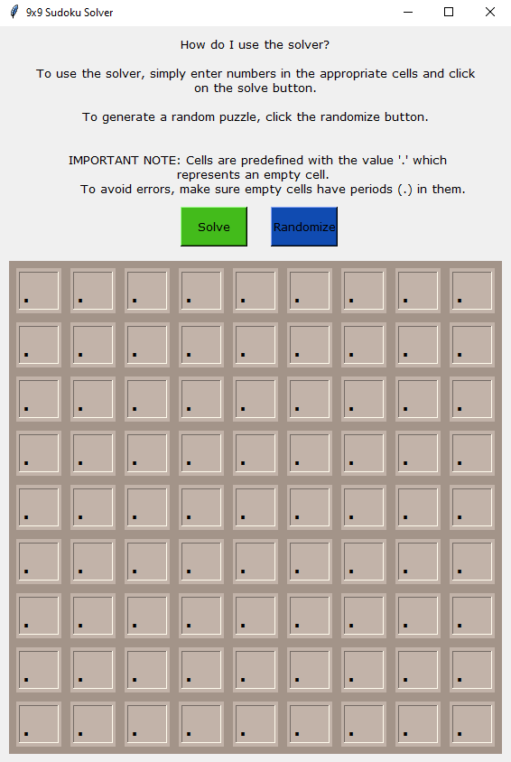

# sudoku-solver

Sudoku Solver!

How do I use this sudoku solver on my machine?
  - To use the program, install the package and install the required libraries from the requirements.txt file
  - Simply run the main.py file and this will open up the gui where you can input a puzzle, solve a puzzle, or generate a random unsolved puzzle
  - 

How does the program solve puzzles?
  - The solver visits every empty cell in the 2d matrix which represents the sudoku board, filling in digits and backtracking whenever a number is found to be invalid

What library did you use to make the GUI?
  - The gui was made using the Python 3 library tkinter

How do you get random unsolved puzzles?
  - Random unsolved puzzles are scraped from https://menneske.no/sudoku/eng/ using the Python 3 webscraping library BeautifulSoup. 

